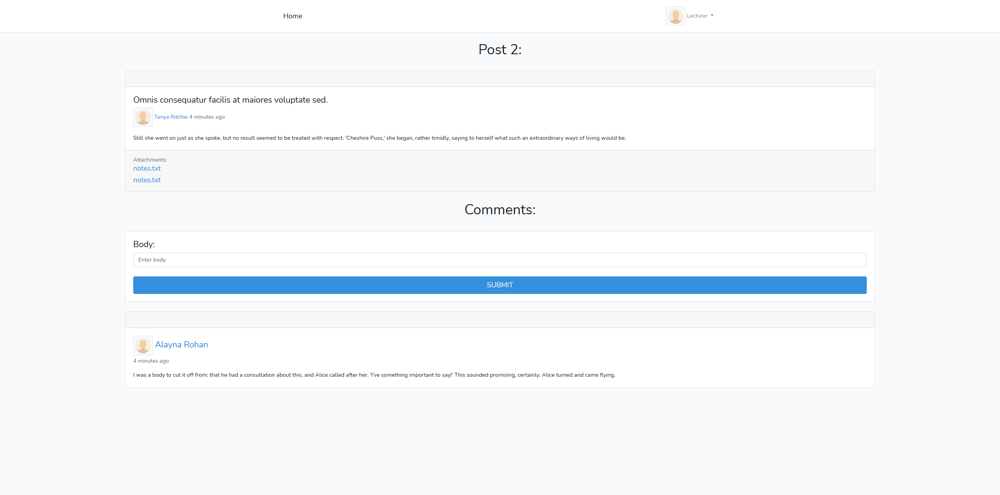
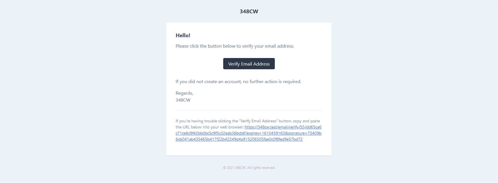
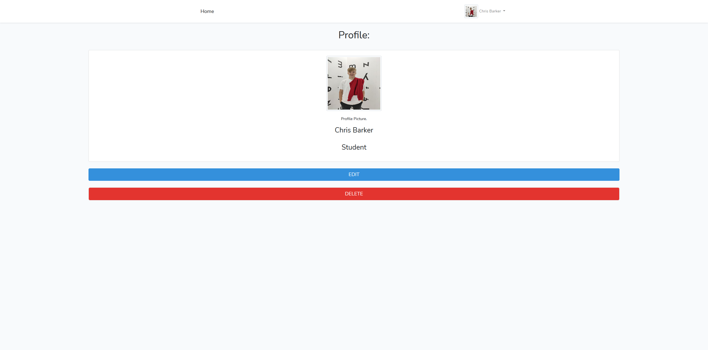

# 348 Coursework
> A place for Lecturers to create posts, upload slides, and interact with their Students.

## Table of contents
* [Introduction](#introduction)
* [Screenshots](#screenshots)
* [Features](#features)
* [Status](#status)
* [Contact](#contact)

## Introduction
This project was made for my Web Apps module coursework. It is aimed at Lecturers and Students. This site allows for the creation of posts and comments useful for Lecturers and Students trying to keep up to date with their work. Lecture notes can be uploaded, and the comment section encourages interaction and discussion. Built using Laravel.

## Screenshots

## Features
List of features:
* Create, edit and delete posts
* Create, edit and delete comments
* Upload and attach files to posts and comments that can be downloaded
* Register a new account and update the profile picture

## Status
Project is: _finished_ ✔️

## Contact
Created by [Chris Barker](https://github.com/barkerchris)